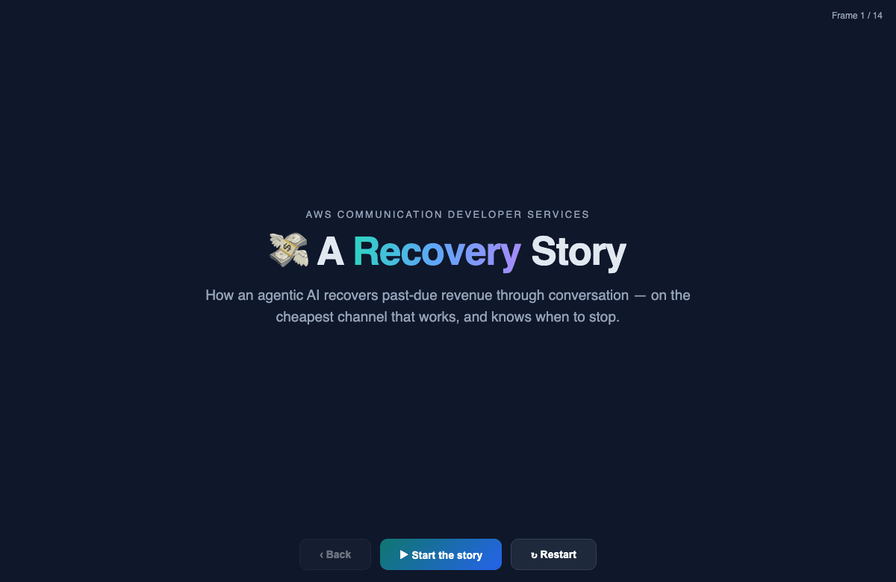
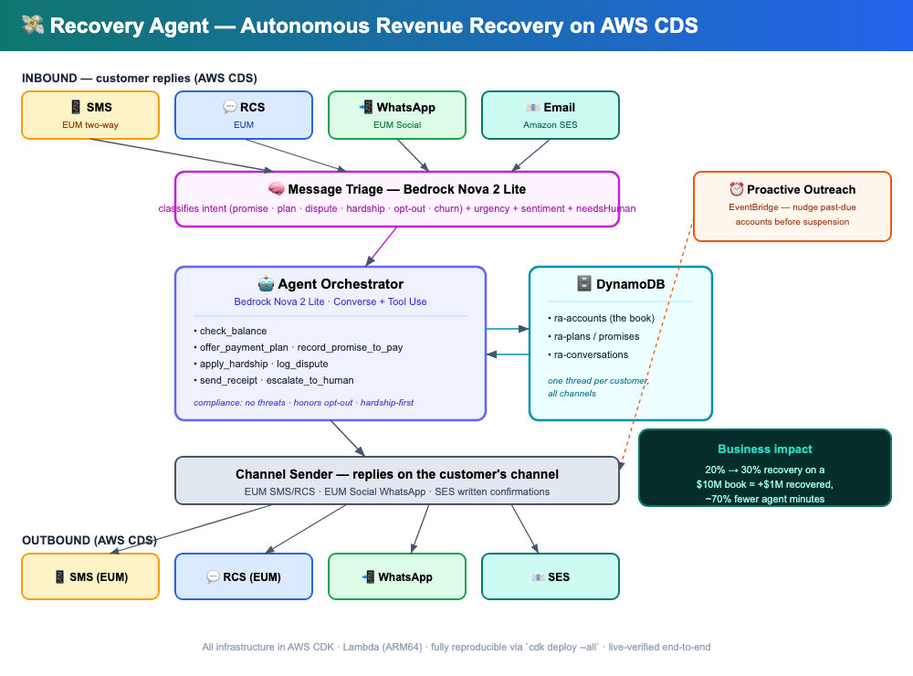

# 💸 Recovery Agent — Autonomous Omnichannel Revenue Recovery

> An agentic AI that recovers past-due telecom revenue through **conversation instead of robocalls** — reaching each customer on the channel they actually answer, negotiating payment plans, honoring hardship and opt-outs, and keeping one continuous thread across SMS, RCS, WhatsApp, and email.

[](https://aws.amazon.com/end-user-messaging/)
[](https://aws.amazon.com/bedrock/)
[](LICENSE)



> **The escalation ladder in one view:** the agent reaches the customer on the cheapest channel first (📧 Email → 📱 SMS → 💬 RCS → 📲 WhatsApp), escalates only when there's no response, and **stops the moment the customer engages** — then reasons and acts (hardship hold, dispute pause, opt-out). Total outreach spend: ~5¢.

## The Business Problem

Telecom is a massive, under-served collections category — and the tools used to collect are failing:

- **Telecom is more than a fifth of all U.S. debt-collection revenue**, and one of the most common tradelines in consumers' credit files. *(CFPB, 2018)*
- The ARM (collections) industry recovers only **~11% of face value** — most past-due money is never recovered. *(ACA International)*
- **Live-agent contact is expensive:** the industry median is **~$13.50 per agent-assisted contact** vs **~$1.84 for self-service** *(Gartner)*; collections calls commonly run **$5–$25 each**, most reaching voicemail.
- Aggressive collection **drives churn** — a mishandled past-due customer cancels and never comes back, destroying lifetime value far larger than the balance.
- It's also **heavily regulated** (FDCPA / Regulation F): quiet-hours limits (no contact before 8am / after 9pm), mandatory opt-out, no harassment — and debt collection is consistently among the most-complained-about financial topics to the CFPB.

The result: carriers leave money on the table *or* spend heavily to recover it while burning relationships and risking compliance violations.

## The Solution — and the ROI

**Recovery Agent** collects the way a great human agent would — on every channel, instantly, 24/7, at near-zero marginal cost — via an **intelligent escalation ladder**: start on the cheapest channel that can work, escalate only on silence, and stop the instant the customer engages.

> **Mature AI collections cut cost-to-collect by 25–35%** *(Deloitte, 2025)*. In this demo, the agent reaches and resolves an account for **~$0.05** across four channels — against **$5–$25** for a single live-agent call attempt (a 100×+ per-contact advantage). On a **$10M** past-due book, a 25–35% lower cost-to-collect plus a modest recovery lift is a **seven-figure swing**.

It reaches customers where they respond, offers real options with real numbers, and — critically — **knows when to stop**: it leads with empathy on hardship, pauses on disputes, honors opt-outs instantly, and respects quiet hours. That protects the relationship *and* keeps the carrier compliant.

```
📧 SES email   → Day 0 · cheapest first touch (~$0.0001/msg)
📱 SMS         → Day 3 · escalate on silence (~$0.0075/msg)
💬 RCS         → Day 7 · rich tap-to-pay card (~$0.012/msg; RCS→SMS fallback)
📲 WhatsApp    → Day 10 · premium touch for high-value/overdue (~$0.035/msg)
→ ladder STOPS the moment the customer engages on any channel
```

### What makes it agentic (not a robo-dialer)

| Capability | Behavior |
|---|---|
| **Inbound triage** | Bedrock classifies every reply — *promise-to-pay, payment-plan, dispute, hardship, opt-out, churn-threat* — with sentiment and a human-needed flag, then routes accordingly |
| **Payment-plan negotiation** | Splits a balance into realistic installments sized against the monthly charge |
| **Hardship handling** | Detects distress (job loss, illness), applies a hold, suppresses fees, routes to a specialist |
| **Dispute handling** | Pauses collection on the disputed amount and opens a review |
| **Compliance by design** | Never threatens; honors STOP/opt-out immediately; escalates legal/bankruptcy mentions |
| **Cross-channel memory** | One DynamoDB thread per customer — pick up on WhatsApp exactly where the SMS left off |

## Architecture



| Service | Role |
|---|---|
| **AWS End User Messaging (EUM)** | SMS + RCS — proactive nudges, rich-card options |
| **AWS End User Messaging Social** | WhatsApp — negotiation, hardship, document collection |
| **Amazon SES** | Email — confirmations and the compliance paper trail |
| **Amazon Bedrock (Nova 2 Lite)** | Agent reasoning + inbound message triage |
| **AWS Lambda (ARM64)** | Serverless compute for every component |
| **Amazon DynamoDB** | Cross-channel conversation state + the past-due book |
| **Amazon API Gateway** | Inbound webhooks per channel |
| **AWS CDK** | Infrastructure as code — one-command, fully reproducible |

```
inbound reply (any channel)
  → ra-message-triage        Bedrock classifies intent + urgency + sentiment
  → ra-agent-orchestrator    Bedrock Converse loop + 7 collections tools
  → ra-channel-sender        EUM SMS/RCS · EUM Social WhatsApp · SES
       ↕ ra-accounts / ra-plans / ra-conversations (DynamoDB)
```

## Live Deployment Evidence

Real AWS CDS calls, not mocks (all Bedrock via **Amazon Nova 2 Lite**):

- **End-to-end chain** — an inbound reply flows `triage → orchestrator → sender → live SES receipt` through three deployed Lambdas in one transaction (CloudWatch-verified).
- **Message triage (live)** — a hardship message classifies as `hardship / distressed / needsHuman`, an opt-out as `opt_out / critical / needsHuman`.
- **Amazon SES (live)** — written confirmations delivered via `@aws-sdk/client-sesv2 SendEmailCommand`.
- **EUM SMS (live)** — `SendTextMessage` via `@aws-sdk/client-pinpoint-sms-voice-v2` (sandbox simulator; identical SDK path).
- **WhatsApp** — `@aws-sdk/client-socialmessaging SendWhatsAppMessage` wired; fires once a WhatsApp Business number is registered through EUM Social (a Meta-side onboarding step, not a code change).

## Qualifying AWS CDS SDK usage (for judging)

| CDS service | Package | Call site |
|---|---|---|
| EUM (SMS/RCS) | `@aws-sdk/client-pinpoint-sms-voice-v2` | `lib/lambda/channel-sender/index.ts` → `SendTextMessageCommand` |
| EUM Social (WhatsApp) | `@aws-sdk/client-socialmessaging` | `lib/lambda/channel-sender/index.ts` → `SendWhatsAppMessageCommand` |
| Amazon SES | `@aws-sdk/client-sesv2` | `lib/lambda/channel-sender/index.ts` → `SendEmailCommand` |

## Try It

```bash
npm install --registry=https://registry.npmjs.org/
npm run demo:local            # full offline journey in the terminal
npm test                      # infra + logic tests

# Deploy (your AWS account)
npx cdk deploy --all
```

The four-phone demo UI (`demo/web/index.html`) animates the full journey for the video — serve it with any static server.

## Demo Video

🎥 **[3-minute demo](https://youtu.be/PLACEHOLDER)** — robocall problem → agent recovers a balance across four channels → the dollar-ROI close.

## Submission Artifacts

| # | Artifact | Location |
|---|---|---|
| 1 | Code Repository | This repo |
| 2 | Architecture Diagram | `docs/architecture.png` |
| 3 | Text Description | This README |
| 4 | Demo Video | [YouTube](https://youtu.be/PLACEHOLDER) |
| 5 | Deployed Project | CloudFront demo UI + deployed Lambdas (see Live Deployment Evidence) |
| 6 | ACE Opportunity ID | `OPP-XXXXXXXXX` |

## Sources

Market and ROI figures above are drawn from public sources:
- CFPB, *Quarterly Consumer Credit Trends: Collection of Telecommunications Debt* (2018) — telecom = >1/5 of collection revenue
- ACA International — ARM industry recovery rate (~11% of face value)
- Gartner — cost per contact (~$1.84 self-service vs ~$13.50 agent-assisted)
- Deloitte (2025) — mature AI collections cut cost-to-collect 25–35%
- Fact.MR, *Debt Collection Services Market* (2025) — market size
- CFPB *FDCPA Annual Reports* (2023, 2025); *Regulation F* (12 CFR Part 1006) — compliance rules

See [demo/RESEARCH_BRIEF.md](demo/RESEARCH_BRIEF.md) for the full brief with per-claim confidence notes.

## License

[MIT](LICENSE) · Built for the [AWS CDS Agentic AI Partner Hackathon](https://aws-cds-partner.devpost.com/).
